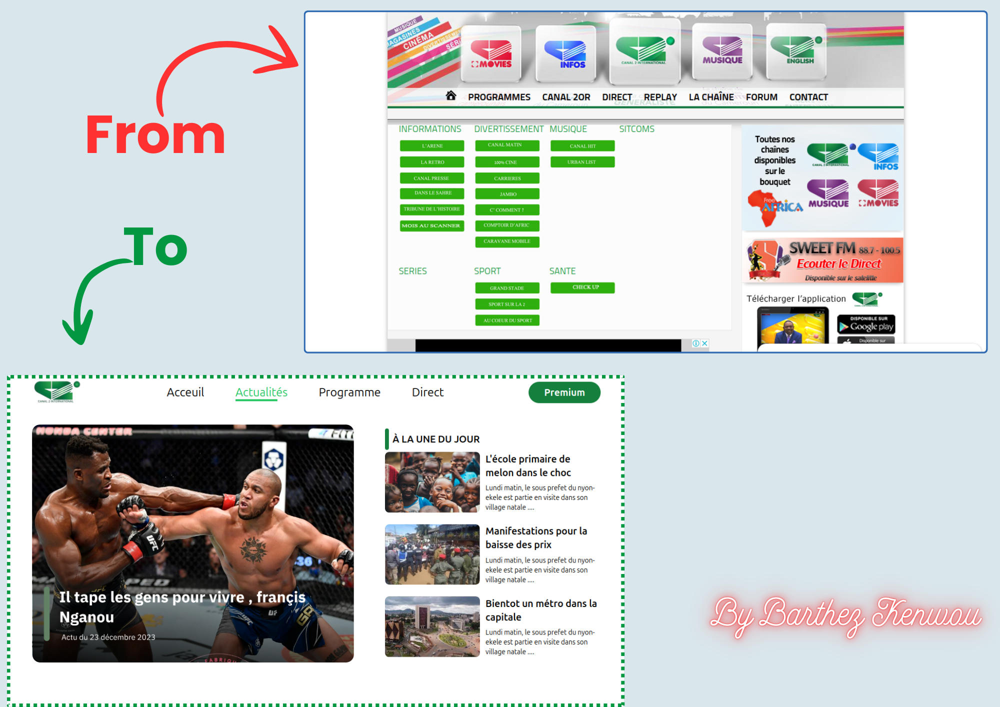
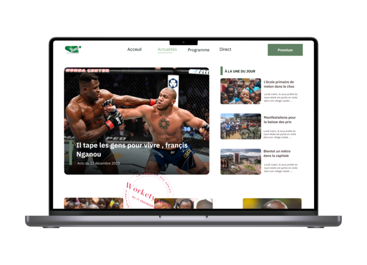

# Site de Presse: Canal 2 International

Petit projet front-end de refonte du site officiel de Canal 2 internationnal.

## Demo

###### [Preview here](https://www.github.com/01Barthez)

## Learned

- apprentissages des Bases du **HTML**
- Instalations et premiers pas avec **tailwinds cli**
- manipulations des **flex**,  et de diverses **proprietés css**
- manipulation des **Images svg** et Intégration des **iframes** dans le projets
- ...

## Authors

- [Barthez](https://www.github.com/01Barthez)

## Contributing

La grande Equipe Worketyamo pour le design UI. et pour l'accompagnement.

